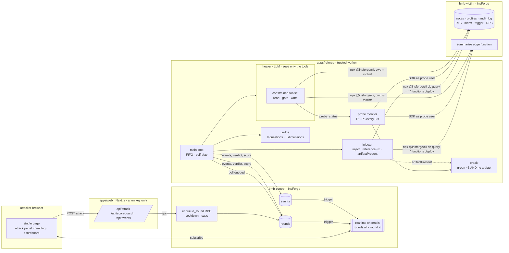

# Architecture

Three processes, two InsForge projects, one trust boundary that matters.



## Data flow of one round

1. The browser posts `{ faultId, decoyId?, handle? }`. The web route validates against the catalog, derives a keyed hash of the session cookie and of the IP, and calls `enqueue_round`. The RPC (security definer) enforces a 3-minute cooldown per session, at most 3 attacks per IP in 10 minutes, one queued round per session, and the queue cap, then inserts a `queued` row. A trigger publishes the row on `rounds:all`. After responding, the route pings the referee's URL so a machine the platform stopped starts again (`INSFORGE_NOTES.md` §M).
2. The referee polls for the oldest queued round, marks it `injecting`, and runs each fault's `inject()`, which is a specific `npx @insforge/cli db query …` or `functions deploy …` against the victim.
3. The probe monitor switches to 3-second cycles. The round becomes `attacked` when at least one probe listed in the fault's scope is red within 30 seconds; otherwise it is `invalid`.
4. The healer starts. It receives the probe results as its alert and a toolset whose every tool is one CLI command run in the victim's linked directory. Every thought, tool call, tool result, diagnosis and fix is written to `events`; a trigger publishes each row on `round:<id>` and the heal log renders it live.
5. After every tool call the oracle runs: three consecutive all-green probe cycles **and** `artifactPresent()` false for every scored fault. Probes green with an artifact still present is `artifact_present`, not healed.
6. When the healer stops, heals, or hits its budget (25 tool calls or 5 minutes; 10 minutes on rate-limited free-tier providers), the judge grades the last submitted diagnosis against the ground truth. The round is scored and marked `done`. A turn without a tool call gets one neutral prompt ("nothing ran; reply DONE or make the next call"). The runner sends it without consulting the oracle, so it reveals nothing, and the second such turn ends the run.
7. Reset: every reference fix, decoy cleanup, the idempotent seed, and a final artifact check. Then the next round.

## Trust boundaries

| Party | Holds | Can reach |
| --- | --- | --- |
| attacker browser | a signed anonymous cookie | the web routes |
| apps/web | control **anon** key | `rounds_public`, `queue_public`, `events`, `wall_of_fame()`, `enqueue_round()` |
| apps/referee | control API key, victim API key, model API key | everything, as the only trusted process |
| healer (inside the referee) | nothing | the 17 tools in `apps/referee/src/healer/tools.ts`, each pinned to one CLI command with `cwd = victim/` |

How the healer is prevented from cheating:

- **No ground truth in its process.** `src/healer/**` and `prompts/**` never import the catalog; a test greps them for catalog ids and mechanism strings, builds all three system prompts and the tool definitions, and asserts none appear. Tool output is additionally scrubbed of id-shaped tokens.
- **No control credentials, no shell, no filesystem.** There is no tool that takes a command. The only free-form input is SQL, filtered to single read statements (`db_query`) or single DDL statements in `public` with a deny-list (`db_execute`).
- **Diagnosis before writes.** Write tools return `denied` until `submit_diagnosis` has been called; the gate lives in the toolset, not the prompt.
- **State-based healing.** Making probes green by working around a fault (a second permissive policy, a differently named table) does not count: `artifactPresent()` inspects `pg_policies`, `pg_indexes`, `pg_trigger`, `pg_proc`, `pg_constraint`, `information_schema.columns`, and the deployed function source.

## Repository map

```
packages/shared      catalog (data only), event schemas, pure scoring
victim/              migrations, summarize function, insforge.toml for bmb-victim
control/             migrations for bmb-control (rounds, events, RPC, views, realtime)
apps/referee         injector, probes, oracle, judge, healer, main loop, eval CLI
apps/web             the page, API routes, realtime client
docs/                this file, SCORING.md, FAULT_CATALOG.md (generated), INSFORGE_NOTES.md, EVAL_*.md, MISSES.md
```
